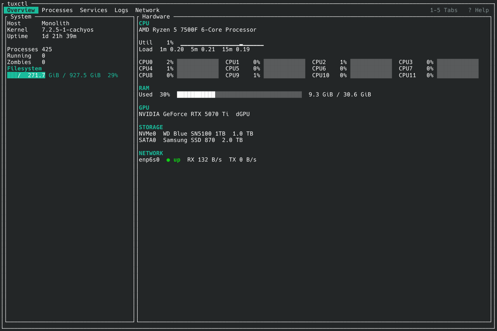
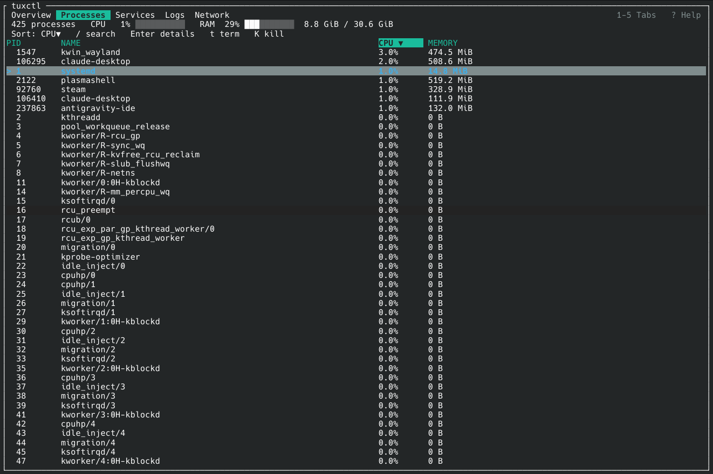
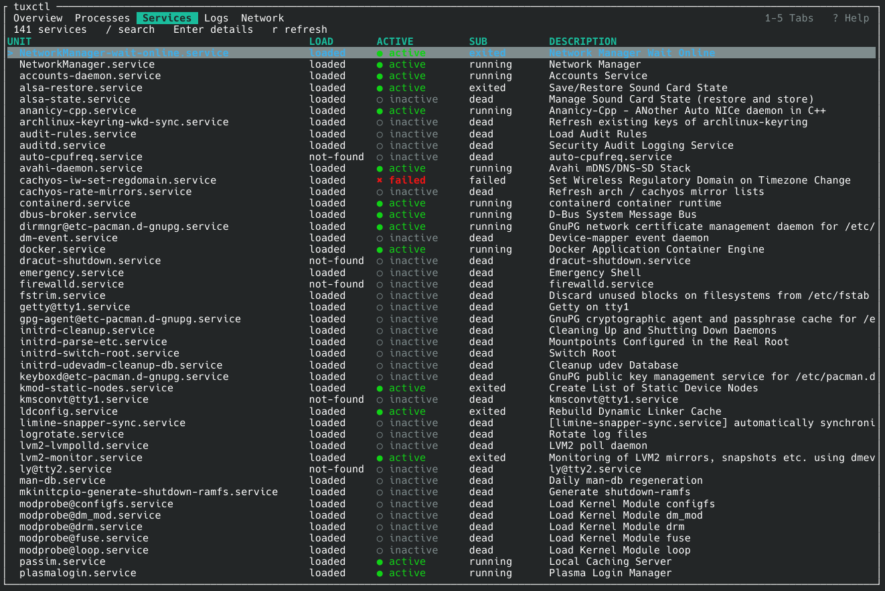
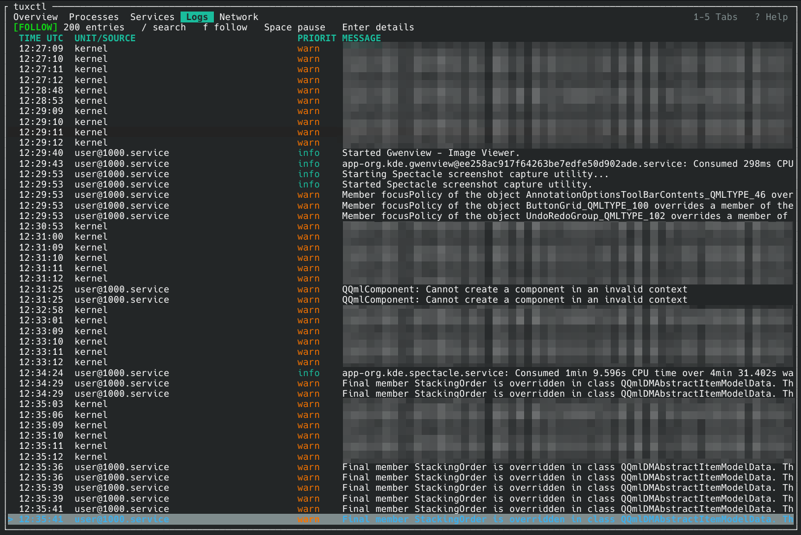
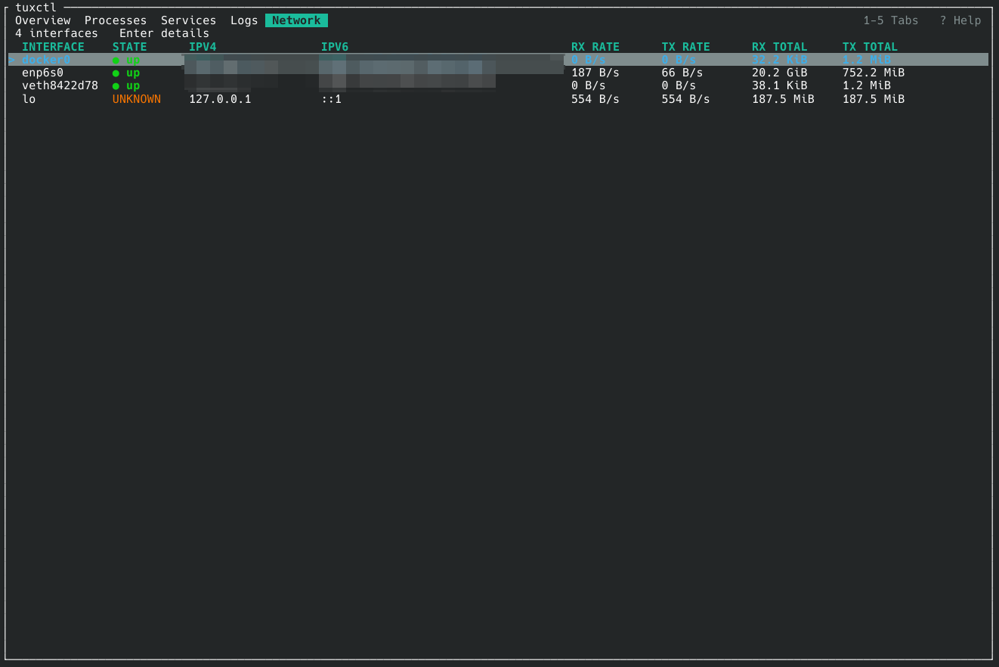
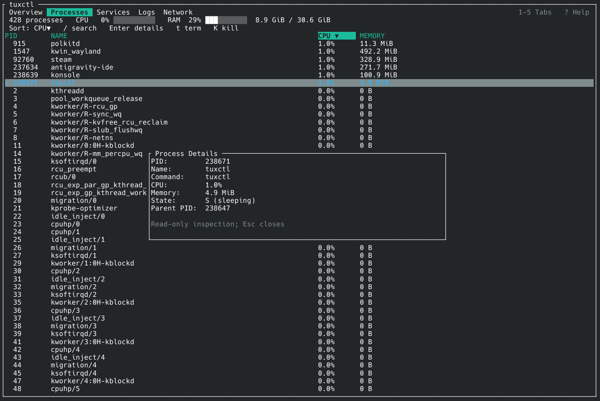
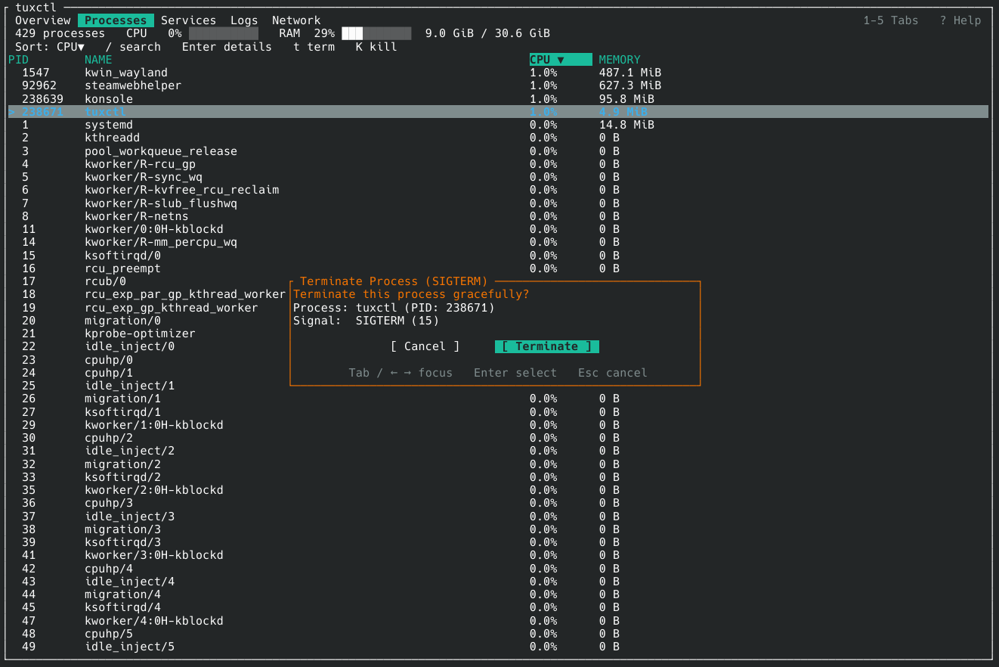
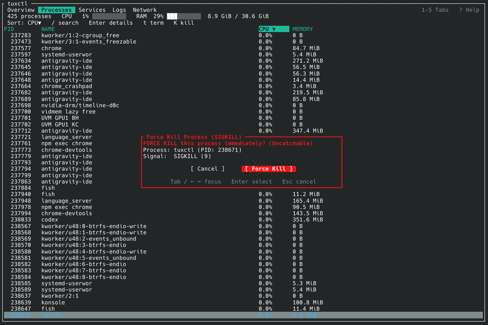
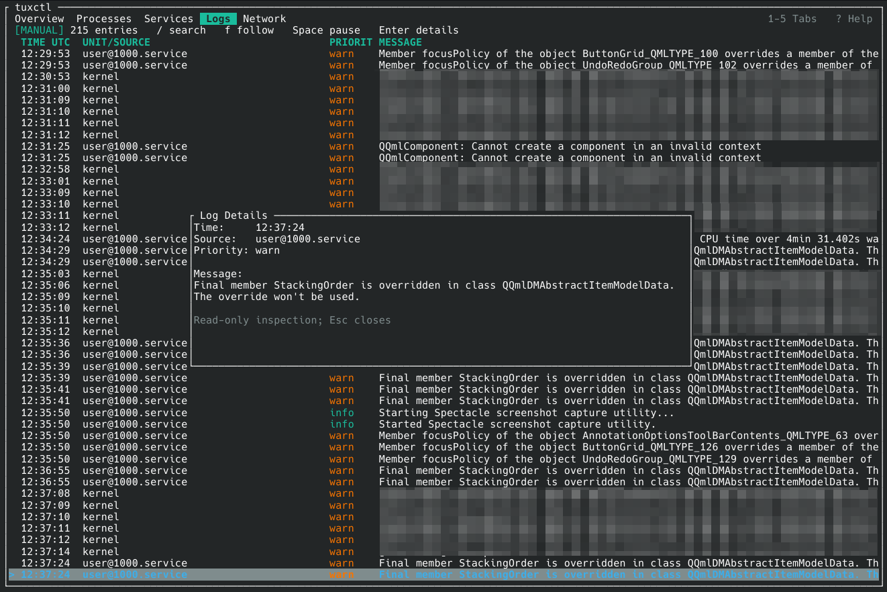
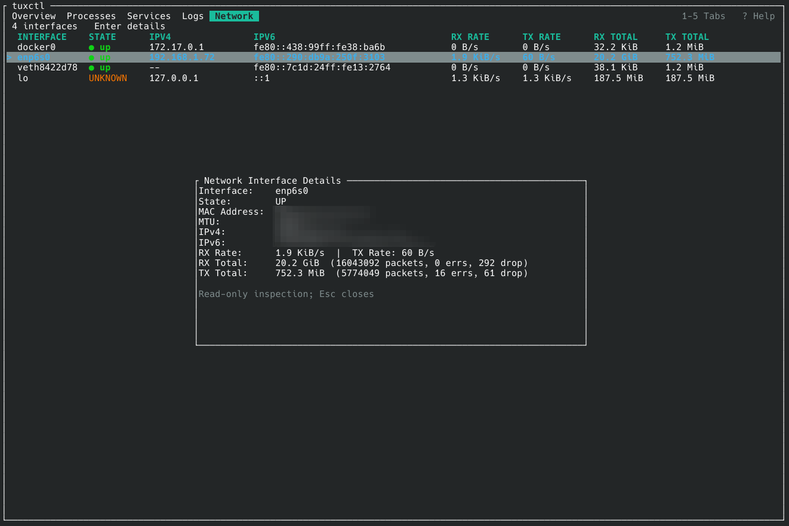

# tuxctl

[](https://github.com/Seqat/tuxctl/actions/workflows/ci.yml)
[](https://github.com/Seqat/tuxctl/releases/latest)
[](LICENSE)
[](Cargo.toml)

`tuxctl` is a lightweight, responsive, Linux-native control-center TUI written in Rust with [Ratatui](https://ratatui.rs/) and [Crossterm](https://github.com/crossterm-rs/crossterm).

It provides real-time system monitoring, process management, systemd service inspection, journal logs, hardware information, and network interface statistics in a restrained, terminal-native interface.

<p align="center">
  
</p>

## Quick Start

Static binaries for x86_64 and aarch64 Linux are attached to every [release](https://github.com/Seqat/tuxctl/releases/latest):

```sh
curl -LO https://github.com/Seqat/tuxctl/releases/latest/download/tuxctl-$(uname -m)-unknown-linux-musl.tar.gz
tar xzf tuxctl-$(uname -m)-unknown-linux-musl.tar.gz
./tuxctl-$(uname -m)-unknown-linux-musl/tuxctl
```

Or build it with Rust 1.88 or newer: `cargo install --git https://github.com/Seqat/tuxctl --tag v0.2.7 --locked`. See [Installation](#installation) for checksums and other options.

## Features

### Overview

- Responsive **System** and **Hardware** dashboard.
- System information:
  - Hostname and kernel version.
  - Uptime.
  - Process, running-process, and zombie counts.
  - Root filesystem usage.
- Live CPU monitoring:
  - Aggregate CPU utilization.
  - Bounded CPU utilization history.
  - 1-minute, 5-minute, and 15-minute load averages.
  - Per-logical-CPU utilization.
  - Responsive logical-CPU grid for different terminal sizes.
- Live RAM usage with used/total capacity.
- Hardware inventory:
  - CPU model information.
  - RAM module information via EDAC sysfs when available.
  - GPU devices using DRM/NVIDIA sysfs metadata.
  - NVMe and SATA/SCSI storage devices.
- Compact physical network interface summary with live RX/TX rates.
- Responsive layout that switches between side-by-side and stacked dashboards as terminal space changes.

### Processes

- Live process count plus aggregate system CPU and RAM usage.
- Real-time `/proc` process scanner.
- PID, process name, CPU percentage, and resident memory display.
- Sortable columns:
  - CPU (`c`)
  - Memory (`m`)
  - PID (`p`)
  - Name (`n`)
- Case-insensitive search (`/`).
- Detailed process inspection (`Enter`).
- Safe process signaling:
  - SIGTERM with `t`.
  - SIGKILL with `K` / `Shift+K`.
  - Explicit confirmation before destructive actions.
  - `Cancel` is the safe default.
  - Process identity is tracked using `(PID, start_time)`.
  - Final signal delivery uses Linux pidfds to prevent PID-reuse races.
  - Signaling fails closed when safe pidfd signaling is unavailable.

### Services

- systemd unit status viewer.
- Displays:
  - Unit
  - Load state
  - Active state
  - Sub-state
  - Description
- Distinct state indicators:
  - `● active`
  - `✖ failed`
  - `○ inactive`
  - `◌ activating`
- Case-insensitive search (`/`).
- On-demand refresh (`r`).
- Services are collected only while the tab is visible and refreshed each time it is opened.
- Read-only service inspection (`Enter`).

### Logs

- Streaming systemd journal viewer using `journalctl`, started the first time the Logs tab is opened.
- Timestamps in local time (`HH:MM:SS` in the table; full date and UTC offset in the detail view).
- Bounded log storage to prevent unbounded memory growth.
- Bounded journal ingestion with dropped-entry accounting under sustained load.
- Follow mode (`f`).
- Pause/resume (`Space`).
- Severity-based styling for errors, warnings, informational messages, and debug output.
- Search/filter mode (`/`).
- Detailed multiline message viewer (`Enter`).
- Journal ingestion is scheduled so sustained log traffic does not monopolize terminal input handling.

### Network

- Interface monitoring using `/proc/net/dev` and `/sys/class/net`.
- Live RX/TX transfer rates based on elapsed sampling intervals.
- Total RX/TX counters.
- IPv4 and IPv6 addresses.
- Operational state indicators:
  - `● up`
  - `○ down`
  - `◌ dormant`
  - `◌ unknown` (for example, loopback)
- Detailed interface inspection (`Enter`) including:
  - MAC address
  - MTU
  - Packet counts
  - Error counters
  - Dropped packets
- Safe rate-baseline recovery across interface changes and temporary `/proc/net/dev` failures.

### Help

- Contextual keybinding reference overlay (`?`).

---

## Screenshots

### Processes

<p align="center">
  
</p>

### Services

<p align="center">
  
</p>

### Logs

<p align="center">
  
</p>

### Network

<p align="center">
  
</p>


<details>
<summary><strong>Detail views and confirmation dialogs</strong></summary>

### Process Details

<p align="center">
  
</p>

### Process Signal Confirmation

<p align="center">
  
</p>

### Process Kill Confirmation

<p align="center">
  
</p>

### Log Details

<p align="center">
  
</p>

### Network Interface Details

<p align="center">
  
</p>

</details>

---

## Requirements

- **Operating System:** Linux.
  - `tuxctl` directly uses Linux interfaces such as `/proc` and `/sys`.
- **Runtime utilities:**
  - `systemctl` for the **Services** tab.
  - `journalctl` for the **Logs** tab.
- **Rust:** Rust 1.88 or newer for building from source.

> Process signaling uses Linux pidfds for PID-safe signal delivery. If the required pidfd operations are unavailable or denied, `tuxctl` fails closed instead of falling back to unsafe PID-only signaling.

---

## Installation

### Prebuilt Binaries

Each [release](https://github.com/Seqat/tuxctl/releases/latest) has statically linked (musl) binaries for `x86_64` and `aarch64`. They do not depend on the system C library, so they run on any Linux distribution. Download one, verify it against `SHA256SUMS`, and install it:

```sh
arch=$(uname -m)   # x86_64 or aarch64
base=https://github.com/Seqat/tuxctl/releases/latest/download
curl -LO "$base/tuxctl-$arch-unknown-linux-musl.tar.gz" -LO "$base/SHA256SUMS"
sha256sum -c --ignore-missing SHA256SUMS
tar xzf "tuxctl-$arch-unknown-linux-musl.tar.gz"
install -Dm755 "tuxctl-$arch-unknown-linux-musl/tuxctl" ~/.local/bin/tuxctl
```

`~/.local/bin` must be on your `PATH`.

### Install from Source

Install a tagged version directly with Cargo:

```sh
cargo install --git https://github.com/Seqat/tuxctl --tag v0.2.7 --locked
```

Or from a clone of the repository:

```sh
git clone https://github.com/Seqat/tuxctl.git
cd tuxctl
cargo install --path . --locked
```

Then run:

```sh
tuxctl
```

### Release Build

Build an optimized binary without installing it:

```sh
cargo build --release --locked
./target/release/tuxctl
```

### Command-Line Options

```text
tuxctl [--interval <DURATION>]
```

| Option | Description |
| --- | --- |
| `--interval <DURATION>` | Sampling interval for CPU, memory, and network: `250ms`, `500ms`, `1s` (default), `2s`, `5s`, `10s`, `30s`, or `60s`. Processes refresh at most once per second and services at most every 5 seconds. The Overview CPU history shows the time span it covers. |
| `-h`, `--help` | Print help. |
| `-V`, `--version` | Print the version. |

### Development Mode

```sh
cargo run
```

Performance and smoke-test helpers for development live in [`scripts/`](scripts/README.md).

---

## Controls & Keybindings

### Global Controls

| Key | Action |
| --- | --- |
| `1` - `5` | Switch directly to tab: Overview, Processes, Services, Logs, Network |
| `Tab` / `Shift+Tab` | Next / previous tab |
| `→` / `←` | Next / previous tab |
| `?` | Toggle Help dialog |
| `Esc` | Dismiss dialog / clear active search |
| `q` | Quit |
| `Ctrl+C` | Quit globally |

### Navigation & Common Actions

| Key | Action |
| --- | --- |
| `↑` / `k` | Move selection up |
| `↓` / `j` | Move selection down |
| `PageUp` / `PageDown` | Move selection by page |
| `Home` / `End` | Jump to first / last item |
| `/` | Begin search / filter; `↑` / `↓` and `PageUp` / `PageDown` move through the matches while typing |
| `Enter` | Open detailed inspection |

### Processes

| Key | Action |
| --- | --- |
| `c` | Sort by CPU % |
| `m` | Sort by Memory |
| `p` | Sort by PID |
| `n` | Sort by Name |
| `t` | Request `SIGTERM` for selected process |
| `K` / `Shift+K` | Request `SIGKILL` for selected process |

Repeated sort commands toggle the sort direction.

#### Signal Confirmation

| Key | Action |
| --- | --- |
| `Tab` / `←` / `→` / `h` / `l` | Move focus between `Cancel` and confirmation |
| `Enter` | Execute focused action |
| `Esc` | Cancel and close |

### Services

| Key | Action |
| --- | --- |
| `r` | Request an immediate service refresh |

### Logs

| Key | Action |
| --- | --- |
| `f` | Toggle follow mode |
| `Space` | Pause / resume |

### Mouse Controls

- **Tabs:** Click a tab title to switch screens.
- **Selection:** Click rows in Processes, Services, Logs, or Network.
- **Scrolling:** Use the mouse wheel over list/table areas.
- **Process sorting:** Click `PID`, `NAME`, `CPU`, or `MEMORY` headers.
- **Confirmation dialogs:** Click `Cancel` or the confirmation action.

---

## Performance

Measured on an AMD Ryzen 5 7500F with the v0.2.7 release binary (static, x86_64) in a 160×50 terminal at the default 1 s interval. CPU is the percentage of one core; the numbers are a reference from one machine, not a guarantee.

| Scenario | CPU | Redraws/s |
| --- | --- | --- |
| Overview, idle | 0.60 % | 1.2 |
| Processes, idle | 0.65 % | 2.0 |
| Logs, idle | 0.55 % | 0.0 |
| Logs, 200 journal messages/s | 0.80 % | 3.9 |
| Mouse hover at 240 Hz | 1.29 % | 13.4 |

RSS is about 2.2 MiB at startup and 2.3 MiB after 15 minutes, with no growth after warm-up; the binary is 1.4 MB. Every push is also checked on GitHub Actions against fixed redraw limits. See [docs/performance.md](docs/performance.md) for the method, history, and sources of noise.

---

## Design & Reliability

`tuxctl` is designed around a small, bounded, event-driven architecture.

```text
/proc, /sys, systemctl, journalctl
        │   background collectors
        ▼
bounded snapshots (latest value only)
        │
        ▼
App state ◀── keyboard and mouse actions
        │
        ▼
render from cached state ──▶ hit regions for the mouse
```

- Linux collection happens outside rendering.
- Render paths consume cached state rather than performing blocking `/proc`, `/sys`, `systemctl`, or `journalctl` work.
- Periodic system, process, service, and network snapshots use bounded newest-state semantics.
- CPU history and log storage are bounded.
- Journal processing is bounded per main-loop turn.
- Background snapshots that arrive together are applied before a single redraw, and background redraws are limited to one every 50 ms; keyboard, mouse, and resize still redraw immediately.
- `systemctl` listings are bounded by a 10 second timeout, so a hung call cannot stall the Services tab or exit.
- `systemctl` and `journalctl` are not run until the Services or Logs tab is opened; Services collection pauses again while its tab is hidden.
- Status lines keep an active search or filter visible; messages and errors are shown after it, never instead of it.
- If a collector stops delivering data, the frame title shows a `stale` marker for the affected screen instead of presenting frozen data as live.
- Mouse hover updates are semantic and redraw-coalesced rather than rendering on every raw mouse movement.
- Inactive screens can update cached state without forcing unnecessary redraws.
- Terminal restoration remains owned by the main UI lifecycle. SIGTERM, SIGHUP, and SIGINT quit through the same path as `q`, so the terminal is restored before `tuxctl` exits.
- Process signals use pidfds and fail closed if safe delivery cannot be guaranteed.
- Every push and pull request runs the unit tests, a pseudo-terminal smoke test of the release binary, and the redraw-rate guards on GitHub Actions.

---

## Terminal Support

The normal interface requires a terminal size of at least:

```text
40 columns × 15 rows
```

Below either dimension, `tuxctl` displays a terminal-too-small warning instead of attempting to render the normal interface.

Within supported dimensions, layouts adapt to available space. On narrow terminals the tab bar switches to short labels (`Ovr Proc Svc Logs Net`), and Overview sections that do not fit are omitted rather than shown as empty headings; the CPU grid always reports how many logical CPUs are not shown. Long values may be truncated in constrained layouts; horizontal scrolling is not currently provided.

---

## Known Limitations

- **Linux only:** `tuxctl` relies directly on Linux `/proc`, `/sys`, systemd utilities, and Linux-specific process signaling.
- **systemd dependency:** Services and Logs require access to `systemctl` and `journalctl`.
- **Hardware hotplug:** Hardware inventory is discovered at startup. Newly attached hardware is not dynamically re-enumerated until `tuxctl` is restarted.
- **Process permissions:** Signaling another user's or privileged processes is subject to normal Linux permissions.
- **pidfd availability:** Process signaling requires safe pidfd support. `tuxctl` intentionally does not fall back to PID-only signaling if that safety guarantee is unavailable.
- **Terminal size:** Normal rendering requires at least **40×15**.
- **No horizontal scrolling:** Long values may be truncated in narrow layouts.

---

## License

See [LICENSE](LICENSE) for license information.