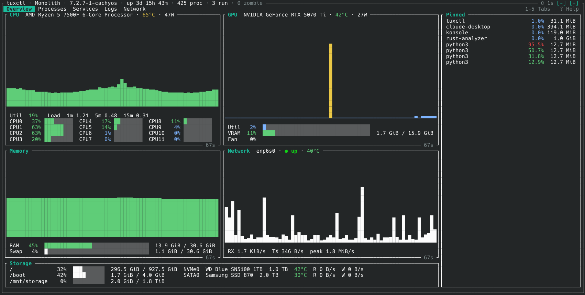
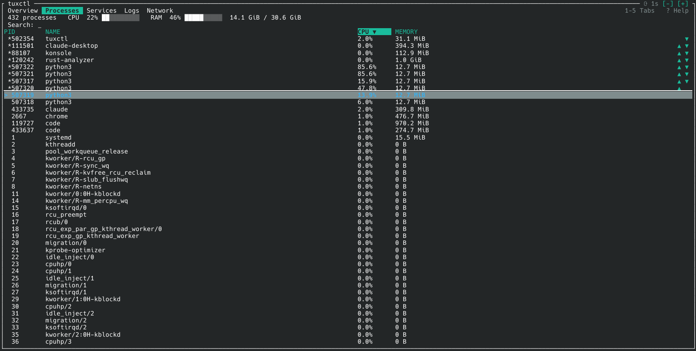
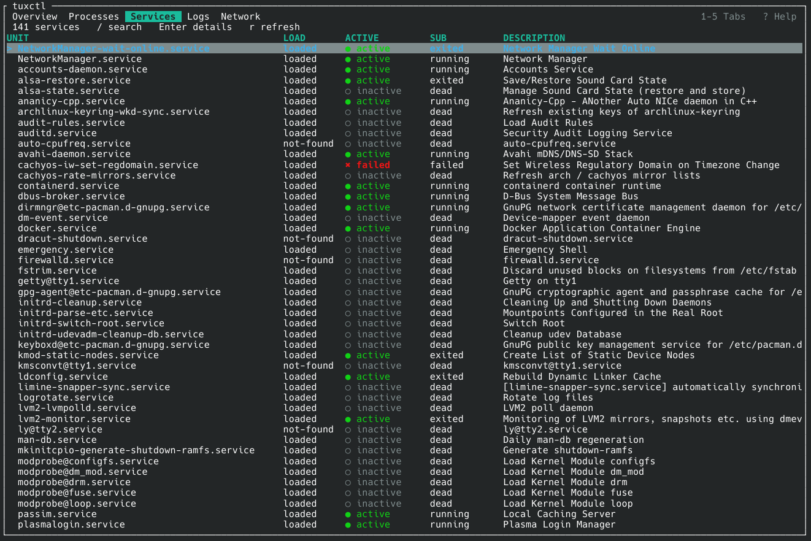
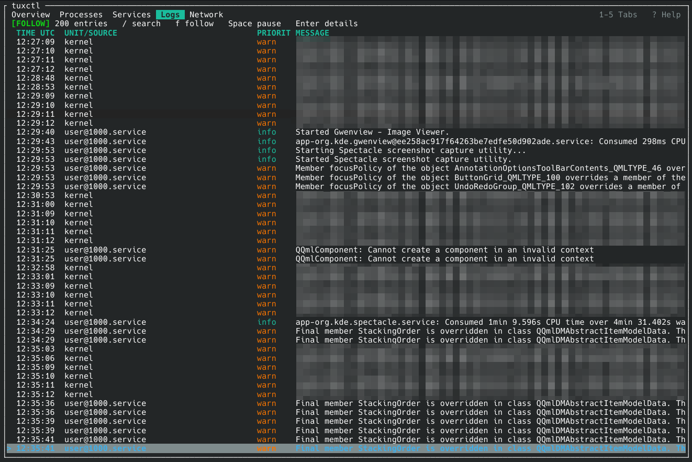
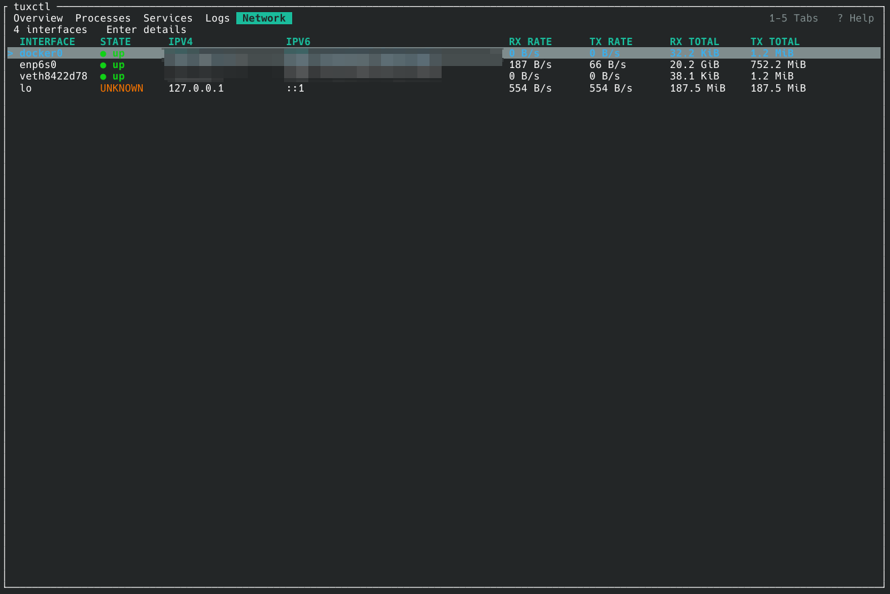
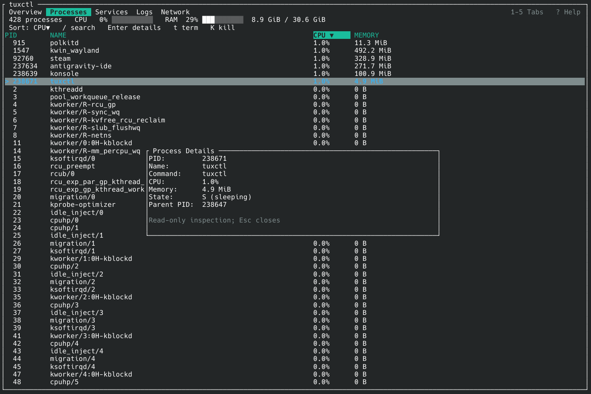
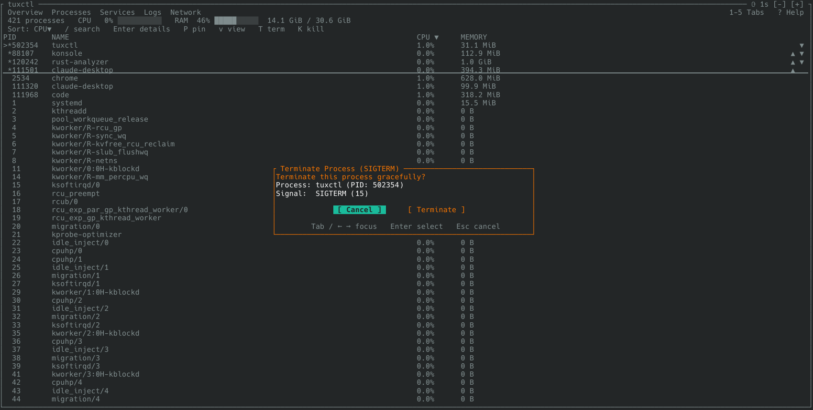
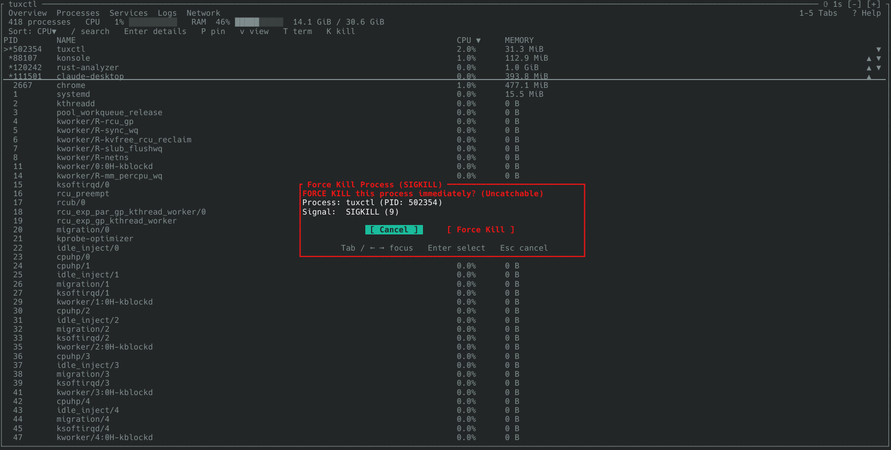
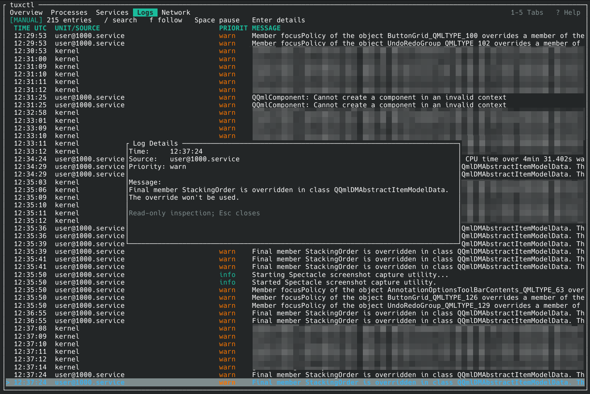
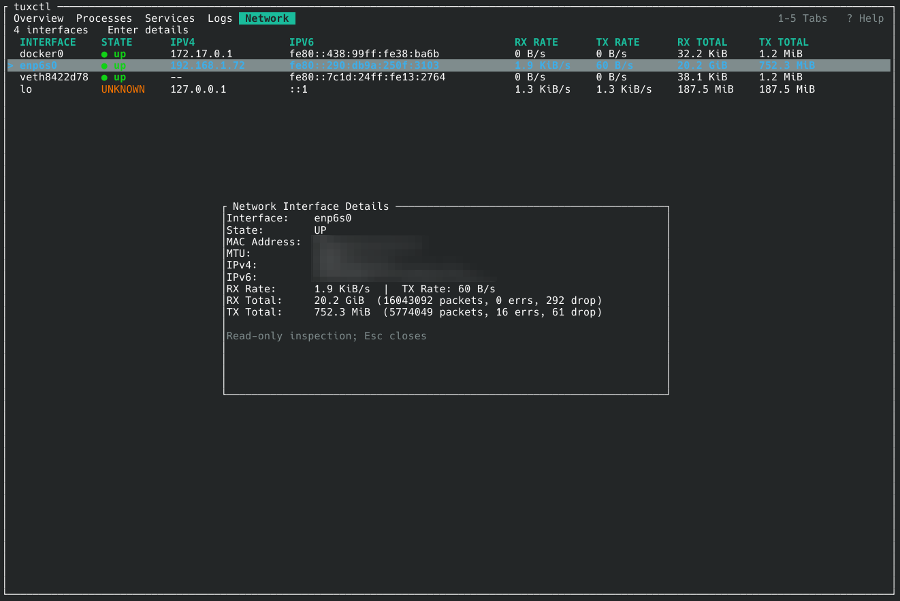

# tuxctl

[](https://github.com/Seqat/tuxctl/actions/workflows/ci.yml)
[](https://github.com/Seqat/tuxctl/releases/latest)
[](LICENSE)
[](Cargo.toml)

`tuxctl` is a lightweight, responsive, Linux-native control-center TUI written in Rust with [Ratatui](https://ratatui.rs/) and [Crossterm](https://github.com/crossterm-rs/crossterm).

It provides real-time system monitoring, process management, systemd service inspection, journal logs, hardware information, and network interface statistics in a restrained, terminal-native interface.

<p align="center">
  
</p>

## Quick Start

Static binaries for x86_64 and aarch64 Linux are attached to every [release](https://github.com/Seqat/tuxctl/releases/latest):

```sh
curl -LO https://github.com/Seqat/tuxctl/releases/latest/download/tuxctl-$(uname -m)-unknown-linux-musl.tar.gz
tar xzf tuxctl-$(uname -m)-unknown-linux-musl.tar.gz
./tuxctl-$(uname -m)-unknown-linux-musl/tuxctl
```

Or build it with Rust 1.88 or newer: `cargo install --git https://github.com/Seqat/tuxctl --tag v0.3.3 --locked`. See [Installation](#installation) for checksums and other options.

## Features

### Overview

- A system summary in the top border: hostname, kernel, uptime, and process, running-process, and zombie counts (zombies are highlighted when there are any). It shortens on narrow terminals: the kernel goes first, then the counts are abbreviated (`397p · 2r · 0z`), then the uptime goes.
- Cards for **CPU**, **GPU**, **Memory**, **Network**, **Storage**, and **Pinned** processes. Each card names its component in its title with the model and temperature (`CPU  Ryzen 5 7500F · 45°C`); the model is shortened first when the title does not fit.
  - **CPU:** a graph of total utilization, utilization and 1/5/15-minute load averages, and a per-logical-CPU grid.
  - **GPU:** the discrete GPU (or the only one), its kind and VRAM, and a row per other GPU.
  - **Memory:** a graph of RAM use and the RAM gauge, plus RAM modules via EDAC sysfs when available.
  - **Network:** the main physical interface with its state and temperature, a traffic graph with its peak, and a row per other interface.
  - **Storage:** root filesystem usage, and NVMe/SATA/SCSI disks with their temperature and live read/write throughput from `/proc/diskstats`.
  - **Pinned:** processes pinned with `P` on the Processes tab, with live CPU and memory.
  - Graphs cover the last 60 samples; the bottom border of each card states the time span they cover.
- Component temperatures: CPU packages, GPUs, NVMe/SATA storage, and network adapters that have a kernel sensor (see [Temperatures](#temperatures)).
- Responsive layout by terminal width: 150 columns and more show a 2×2 grid (CPU | GPU, Memory | Network), Storage below it and Pinned as a column on the right; 100–149 columns show the grid with Storage and Pinned side by side below it; narrower terminals stack the cards (CPU, Memory, Pinned, Network, Storage, GPU) with each graph in its card's title row.

#### Temperatures

A temperature appears next to a component only when the kernel provides a sensor for it; components without one show nothing. `–` means the sensor exists but has no value right now, for example while a GPU is runtime-suspended. A value is highlighted only when it reaches a limit reported by the driver (`temp*_max` or `temp*_crit`); `tuxctl` does not invent thresholds. Sensors are read at most every 2 seconds, whatever the sampling interval.

| Component | Source |
| --- | --- |
| Intel CPU | `coretemp`: the `Package id N` sensor, or the hottest core when there is none |
| AMD CPU | `k10temp` or `zenpower`: `Tdie`, else `Tctl` (per-CCD sensors are not used) |
| Other CPUs (ARM, SoCs) | Only without a CPU hwmon driver: the hottest thermal zone whose type names the CPU or SoC (never `acpitz`) |
| AMD GPU | `amdgpu` (the `edge` sensor) or `radeon` hwmon |
| Intel GPU | `i915` / `xe` hwmon, when the GPU has its own sensor; integrated GPUs usually do not |
| NVIDIA GPU, `nouveau` | `nouveau` hwmon |
| NVIDIA GPU, proprietary driver | NVML (`libnvidia-ml.so.1`, installed with the driver); not in the static release binaries |
| NVMe | `nvme` hwmon (`Composite`) |
| SATA / SAS | `drivetemp` hwmon, only when that module is loaded (see the note below) |
| Network adapter | A hwmon sensor on the adapter or on its PHY |

RAM (SPD) sensors are not shown.

**NVIDIA proprietary driver.** Its GPUs have no hwmon sensor, so their temperature comes from NVML, which `tuxctl` loads only when it finds a GPU using the `nvidia` driver. NVML is expensive in memory: on the reference machine below it adds about 20 MiB of private memory (`RssAnon` +20.2 MiB, PSS +21.4 MiB; RSS +24.7 MiB including 4.5 MiB of shared library pages) and one thread, from the first reading on. `--no-nvidia-temperature` leaves NVML unloaded. The static release binaries cannot load NVML at all, so they show no temperature for these GPUs; use a glibc build, such as one built with `cargo install`.

**Runtime power management.** `tuxctl` never wakes a sleeping GPU: it reads `power/runtime_status` first and shows `–` while the GPU is suspended. NVML stays initialized only when the GPU cannot runtime-suspend anyway (`power/control` is `on`, or the driver reports `Runtime D3 status` as not supported or disabled). With RTD3 enabled, as on many hybrid laptops, NVML is initialized for each reading and shut down right after, and only while every NVIDIA GPU is awake, so `tuxctl` never keeps the GPU powered.

**SATA and SAS disks.** Their temperature needs the kernel's `drivetemp` module, which ships with the kernel but is usually not loaded. It is optional: without it `tuxctl` works normally and shows no temperature for these disks. `tuxctl` never loads it for you. To load it now and at every boot:

```sh
sudo modprobe drivetemp
echo drivetemp | sudo tee /etc/modules-load.d/drivetemp.conf
```

Restart `tuxctl` afterwards: it looks for new sensors at startup. To undo, delete `/etc/modules-load.d/drivetemp.conf`.

> **Hard disks:** per the [kernel documentation](https://docs.kernel.org/hwmon/drivetemp.html), reading the temperature may reset the spin-down timer on some drives (observed with WD120EFAX). `tuxctl` reads it every 2 seconds, so such a drive would never spin down. SSDs do not spin, so this does not concern them. If you rely on hard disks spinning down, leave `drivetemp` unloaded.

### Processes

- Live process count plus aggregate system CPU and RAM usage.
- Real-time `/proc` process scanner.
- PID, process name, CPU percentage, and resident memory display.
- Sortable columns:
  - CPU (`c`)
  - Memory (`m`)
  - PID (`p`)
  - Name (`n`)
- Case-insensitive search (`/`).
- Pinning (`P`): keep up to 8 processes at the top of the list, in your own order.
- Kernel-thread filter (`v`).
- Detailed process inspection (`Enter`).
- Safe process signaling:
  - SIGTERM with `T` / `Shift+T`.
  - SIGKILL with `K` / `Shift+K`.
  - Explicit confirmation before destructive actions.
  - `Cancel` is the safe default.
  - Process identity is tracked using `(PID, start_time)`.
  - Final signal delivery uses Linux pidfds to prevent PID-reuse races.
  - Signaling fails closed when safe pidfd signaling is unavailable.

### Services

- systemd unit status viewer.
- Displays:
  - Unit
  - Load state
  - Active state
  - Sub-state
  - Description
- Distinct state indicators:
  - `● active`
  - `✖ failed`
  - `○ inactive`
  - `◌ activating`
- Case-insensitive search (`/`).
- View filter (`v`): hide `not-found` units or show only failed ones.
- On-demand refresh (`r`).
- Services are collected only while the tab is visible and refreshed each time it is opened.
- Read-only service inspection (`Enter`).

### Logs

- Streaming systemd journal viewer using `journalctl`, started the first time the Logs tab is opened.
- Timestamps in local time (`HH:MM:SS` in the table; full date and UTC offset in the detail view).
- Bounded log storage to prevent unbounded memory growth.
- Bounded journal ingestion with dropped-entry accounting under sustained load.
- Follow mode (`f`).
- Pause/resume (`Space`).
- Severity-based styling for errors, warnings, informational messages, and debug output.
- Search/filter mode (`/`).
- Minimum-priority view (`v`): notice, warning, or error and above.
- Detailed multiline message viewer (`Enter`).
- Journal ingestion is scheduled so sustained log traffic does not monopolize terminal input handling.

### Network

- Interface monitoring using `/proc/net/dev` and `/sys/class/net`.
- Live RX/TX transfer rates based on elapsed sampling intervals.
- Total RX/TX counters.
- IPv4 and IPv6 addresses.
- Operational state indicators:
  - `● up`
  - `○ down`
  - `◌ dormant`
  - `◌ unknown` (for example, loopback)
- Detailed interface inspection (`Enter`) including:
  - MAC address
  - MTU
  - Packet counts
  - Error counters
  - Dropped packets
- Safe rate-baseline recovery across interface changes and temporary `/proc/net/dev` failures.

### Help and Menu

- Contextual keybinding reference overlay (`?`).
- Main menu (`Esc`) with an About page (version, license, source, minimum Rust version) and Exit.

---

## Screenshots

### Processes

<p align="center">
  
</p>

### Services

<p align="center">
  
</p>

### Logs

<p align="center">
  
</p>

### Network

<p align="center">
  
</p>


<details>
<summary><strong>Detail views and confirmation dialogs</strong></summary>

### Process Details

<p align="center">
  
</p>

### Process Signal Confirmation

<p align="center">
  
</p>

### Process Kill Confirmation

<p align="center">
  
</p>

### Log Details

<p align="center">
  
</p>

### Network Interface Details

<p align="center">
  
</p>

</details>

---

## Requirements

- **Operating System:** Linux.
  - `tuxctl` directly uses Linux interfaces such as `/proc` and `/sys`.
- **Runtime utilities:**
  - `systemctl` for the **Services** tab.
  - `journalctl` for the **Logs** tab.
- **Rust:** Rust 1.88 or newer for building from source.

> Process signaling uses Linux pidfds for PID-safe signal delivery. If the required pidfd operations are unavailable or denied, `tuxctl` fails closed instead of falling back to unsafe PID-only signaling.

---

## Installation

### Prebuilt Binaries

Each [release](https://github.com/Seqat/tuxctl/releases/latest) has statically linked (musl) binaries for `x86_64` and `aarch64`. They do not depend on the system C library, so they run on any Linux distribution. Download one, verify it against `SHA256SUMS`, and install it:

```sh
arch=$(uname -m)   # x86_64 or aarch64
base=https://github.com/Seqat/tuxctl/releases/latest/download
curl -LO "$base/tuxctl-$arch-unknown-linux-musl.tar.gz" -LO "$base/SHA256SUMS"
sha256sum -c --ignore-missing SHA256SUMS
tar xzf "tuxctl-$arch-unknown-linux-musl.tar.gz"
install -Dm755 "tuxctl-$arch-unknown-linux-musl/tuxctl" ~/.local/bin/tuxctl
```

`~/.local/bin` must be on your `PATH`.

The static binaries cannot load NVIDIA's NVML library, so they cannot show temperatures of NVIDIA GPUs on the proprietary driver; build from source for that (see [Temperatures](#temperatures)).

### Install from Source

Install a tagged version directly with Cargo:

```sh
cargo install --git https://github.com/Seqat/tuxctl --tag v0.3.3 --locked
```

Or from a clone of the repository:

```sh
git clone https://github.com/Seqat/tuxctl.git
cd tuxctl
cargo install --path . --locked
```

Then run:

```sh
tuxctl
```

### Release Build

Build an optimized binary without installing it:

```sh
cargo build --release --locked
./target/release/tuxctl
```

### Command-Line Options

```text
tuxctl [--interval <DURATION>] [--no-nvidia-temperature]
```

| Option | Description |
| --- | --- |
| `--interval <DURATION>` | Sampling interval for CPU, memory, and network: `250ms`, `500ms`, `1s` (default), `2s`, `5s`, `10s`, `30s`, or `60s`. Processes refresh at most once per second and services at most every 5 seconds. The Overview CPU history shows the time span it covers. `+` and `-` change the interval while `tuxctl` runs. |
| `--no-nvidia-temperature` | Do not load NVML for NVIDIA GPUs on the proprietary driver. NVML shows their temperature but adds about 20 MiB of private memory (see [Temperatures](#temperatures)); static builds never load it. The Help overlay shows whether it is on. |
| `-h`, `--help` | Print help. |
| `-V`, `--version` | Print the version. |

### Development Mode

```sh
cargo run
```

Performance and smoke-test helpers for development live in [`scripts/`](scripts/README.md).

---

## Controls & Keybindings

### Global Controls

| Key | Action |
| --- | --- |
| `1` - `5` | Switch directly to tab: Overview, Processes, Services, Logs, Network |
| `Tab` / `Shift+Tab` | Next / previous tab |
| `→` / `←` | Next / previous tab |
| `?` | Toggle Help dialog |
| `+` / `-` | Longer / shorter sampling interval (`250ms` to `60s`, shown as `⟳` in the top-right corner) |
| `Esc` | Dismiss dialog / clear the search, then the view filter / open the main menu |
| `q` | Open the main menu on Exit; `Enter` or `q` again quits |
| `Ctrl+C` | Quit immediately, from anywhere |

### Navigation & Common Actions

| Key | Action |
| --- | --- |
| `↑` / `k` | Move selection up |
| `↓` / `j` | Move selection down |
| `PageUp` / `PageDown` | Move selection by page |
| `Home` / `End` | Jump to first / last item |
| `/` | Begin search / filter; `↑` / `↓` and `PageUp` / `PageDown` move through the matches while typing |
| `Enter` | Open detailed inspection |

### Processes

| Key | Action |
| --- | --- |
| `c` | Sort by CPU % |
| `m` | Sort by Memory |
| `p` | Sort by PID |
| `n` | Sort by Name |
| `T` / `Shift+T` | Request `SIGTERM` for selected process |
| `K` / `Shift+K` | Request `SIGKILL` for selected process |
| `P` / `Shift+P` | Pin / unpin the selected process (up to 8) |
| `Shift+↑` / `Shift+↓` | Move the selected pinned process up / down (`Alt+↑` / `Alt+↓` also work) |
| `v` | Hide / show kernel threads |

Repeated sort commands toggle the sort direction. Pinned processes stay at the top in the order you give them, marked with `*`; sorting applies to the rows below them. While a search is active, pinned processes that do not match stay visible but dimmed. A pinned process that exits is shown as `exited` for a few seconds and then removed; it can never be signaled.

#### Signal Confirmation

| Key | Action |
| --- | --- |
| `Tab` / `←` / `→` / `h` / `l` | Move focus between `Cancel` and confirmation |
| `Enter` | Execute focused action |
| `Esc` | Cancel and close |

#### Main Menu

`Esc` opens the main menu when there is no dialog, search, or view filter to clear.

| Key | Action |
| --- | --- |
| `↑` / `↓` | Move between About and Exit (`k` / `j` also work) |
| `Enter` | Open About, or exit `tuxctl` |
| `q` | Exit `tuxctl` |
| `Esc` | Close the menu (from About, go back to the menu) |

### Services

| Key | Action |
| --- | --- |
| `r` | Request an immediate service refresh |
| `v` | Cycle the view: all units → loaded units (hide `not-found`) → failed units |

### Logs

| Key | Action |
| --- | --- |
| `f` | Toggle follow mode |
| `Space` | Pause / resume |
| `v` | Cycle the minimum priority: all → notice → warning → error |

### Mouse Controls

- **Tabs:** Click a tab title to switch screens.
- **Selection:** Click rows in Processes, Services, Logs, or Network.
- **Scrolling:** Use the mouse wheel over list/table areas.
- **Process sorting:** Click `PID`, `NAME`, `CPU`, or `MEMORY` headers.
- **Pinned processes:** Click `▲` / `▼` at the end of a pinned row to move it (shown when there are at least two pins and the terminal is wide enough).
- **Confirmation dialogs:** Click `Cancel` or the confirmation action.
- **Main menu:** Click `About` or `Exit`.
- **Sampling interval:** Click `[-]` / `[+]` next to `⟳` in the top-right corner.

---

## Performance

Measured on an AMD Ryzen 5 7500F with the v0.3.0 release binary (static, x86_64) in a 160×50 terminal at the default 1 s interval. CPU is the percentage of one core; the numbers are a reference from one machine, not a guarantee.

| Scenario | CPU | Redraws/s |
| --- | --- | --- |
| Overview, idle | 0.60 % | 1.1 |
| Processes, idle | 0.75 % | 2.0 |
| Logs, idle | 0.60 % | 0.0 |
| Logs, 200 journal messages/s | 0.87 % | 3.9 |
| Mouse hover at 240 Hz | 1.39 % | 13.5 |

RSS is about 2.3 MiB at startup and after 15 minutes, with no growth after warm-up; the binary is 1.45 MB. Measured alternately with v0.2.7 on the same machine, every difference is within run-to-run noise. Every push is also checked on GitHub Actions against fixed redraw limits. See [docs/performance.md](docs/performance.md) for the method, history, and sources of noise.

---

## Design & Reliability

`tuxctl` is designed around a small, bounded, event-driven architecture.

```text
/proc, /sys, systemctl, journalctl
        │   background collectors
        ▼
bounded snapshots (latest value only)
        │
        ▼
App state ◀── keyboard and mouse actions
        │
        ▼
render from cached state ──▶ hit regions for the mouse
```

- Linux collection happens outside rendering.
- Process names, command lines, journal messages, and other system data are treated as untrusted: control characters and bidirectional overrides are removed before anything reaches the terminal, so escape sequences planted by other users cannot act on it.
- Render paths consume cached state rather than performing blocking `/proc`, `/sys`, `systemctl`, or `journalctl` work.
- Periodic system, process, service, and network snapshots use bounded newest-state semantics.
- CPU history and log storage are bounded.
- Journal processing is bounded per main-loop turn.
- Background snapshots that arrive together are applied before a single redraw, and background redraws are limited to one every 50 ms; keyboard, mouse, and resize still redraw immediately.
- `systemctl` listings are bounded by a 10 second timeout, so a hung call cannot stall the Services tab or exit.
- `systemctl` and `journalctl` are not run until the Services or Logs tab is opened; Services collection pauses again while its tab is hidden.
- Status lines keep an active search or filter visible; messages and errors are shown after it, never instead of it.
- If a collector stops delivering data, the frame title shows a `stale` marker for the affected screen instead of presenting frozen data as live.
- Mouse hover updates are semantic and redraw-coalesced rather than rendering on every raw mouse movement.
- Inactive screens can update cached state without forcing unnecessary redraws.
- Terminal restoration remains owned by the main UI lifecycle. SIGTERM, SIGHUP, and SIGINT quit through the same path as `q`, so the terminal is restored before `tuxctl` exits.
- Process signals use pidfds and fail closed if safe delivery cannot be guaranteed.
- Every push and pull request runs the unit tests, a pseudo-terminal smoke test of the release binary, and the redraw-rate guards on GitHub Actions.

---

## Terminal Support

The normal interface requires a terminal size of at least:

```text
40 columns × 15 rows
```

Below either dimension, `tuxctl` displays a terminal-too-small warning instead of attempting to render the normal interface.

Within supported dimensions, layouts adapt to available space. On narrow terminals the tab bar switches to short labels (`Ovr Proc Svc Logs Net`), and Overview cards that do not fit are omitted in priority order rather than drawn empty. A short CPU card gives up its per-CPU grid first; when part of the grid is shown, it reports how many logical CPUs are not. Long values may be truncated in constrained layouts; horizontal scrolling is not currently provided.

---

## Known Limitations

- **Linux only:** `tuxctl` relies directly on Linux `/proc`, `/sys`, systemd utilities, and Linux-specific process signaling.
- **systemd dependency:** Services and Logs require access to `systemctl` and `journalctl`.
- **NVIDIA temperatures:** GPUs on the proprietary driver need a glibc build; the static release binaries cannot load NVML.
- **Hardware hotplug:** Hardware inventory is discovered at startup. Newly attached hardware is not dynamically re-enumerated until `tuxctl` is restarted.
- **Process permissions:** Signaling another user's or privileged processes is subject to normal Linux permissions.
- **pidfd availability:** Process signaling requires safe pidfd support. `tuxctl` intentionally does not fall back to PID-only signaling if that safety guarantee is unavailable.
- **Terminal size:** Normal rendering requires at least **40×15**.
- **No horizontal scrolling:** Long values may be truncated in narrow layouts.

---

## License

See [LICENSE](LICENSE) for license information.